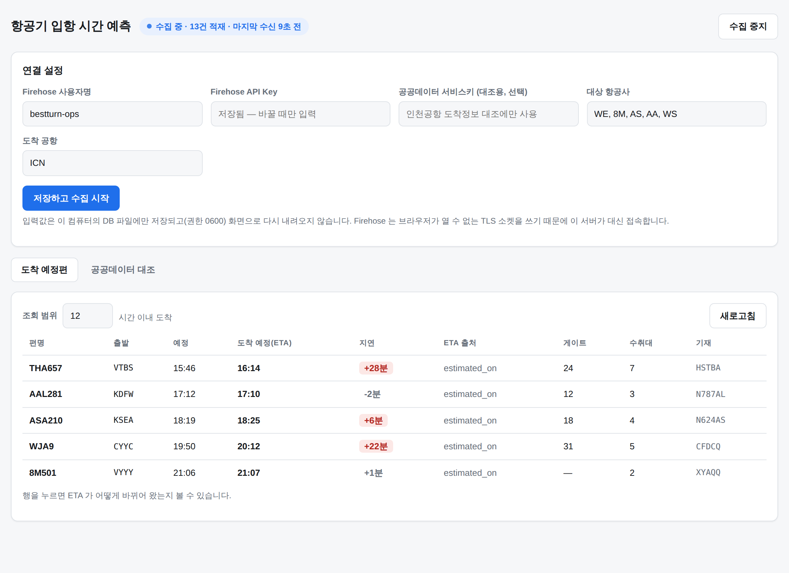

# bestturn

인천공항 현장 업무에 쓰는 두 가지 도구입니다. 서로 독립적이라 코드·의존성·실행을 공유하지 않습니다.

| | 무엇을 하나 | 문서 |
|---|---|---|
| **의전 정보 봇** | 편명 하나로 IB/OB 를 판별해 의전 동선을 브리핑하고, 게이트·카운터·수취대 변동을 텔레그램으로 알립니다 | [docs/incheon-bot.md](docs/incheon-bot.md) |
| **입항 시간 예측** | FlightAware Firehose 로 도착편 ETA 를 실시간 수집해 DB 에 쌓고, 공공데이터와 대조합니다 | [firehose/README.md](firehose/README.md) |

---

## 의전 정보 봇 (`src/incheon_bot/`)

편명만 입력하면 의전 담당자가 필요한 동선을 한 장으로 보여줍니다.
`book` 으로 등록한 편은 변동 사항과 사전 알림을 자동으로 보냅니다.

```
WE501                          → 오늘자 WE501 브리핑 (IB/OB 자동 판별)
/book WE501                    → 변동 알림 + 사전 알림 시작
/memo WE501 VIP 3명, 휠체어 1대  → 메모 저장 (브리핑·알림에 함께 표시)
```

인천국제공항공사 공공데이터 API 를 씁니다. 일일 호출 한도가 있어 조회 결과를 캐시하고
감시 주기를 도착시각에 따라 자동으로 조절합니다.

```bash
pip install -r requirements.txt
cp .env.example .env      # TELEGRAM_BOT_TOKEN, DATA_GO_KR_SERVICE_KEY
PYTHONPATH=src python -m incheon_bot
```

자세한 사용법·설정·운영 전 보정이 필요한 항목은 [docs/incheon-bot.md](docs/incheon-bot.md) 에 있습니다.

---

## 입항 시간 예측 (`firehose/`)

WE · 8M · AS · AA · WS 의 인천(ICN) 도착편을 FlightAware Firehose 로 실시간 수집해
**도착 예정시각(ETA)이 바뀌어 온 이력**과 실제 도착시각을 쌓습니다. 도착 시간 예측 모델의 학습 데이터가 목적입니다.



자격증명만 넣으면 수집·조회·대조가 모두 화면에서 돌아갑니다.

```bat
cd firehose
start.bat          :: 윈도우 — 가상환경 생성부터 실행까지 한 번에
```

```bash
cd firehose
python3 -m venv .venv && source .venv/bin/activate
pip install -r requirements.txt
python run.py      # 맥 · 리눅스
```

Firehose 는 HTTP 가 아니라 **TLS 소켓(1501)** 위의 개행 구분 JSON 스트림이라 브라우저가 직접 열 수 없습니다.
그래서 로컬 서버가 대신 접속하고, 자격증명은 그 PC 의 DB 파일(권한 0600)에만 남습니다.

접속이 안 되면 `python run.py doctor` 가 DNS·포트·TLS 중 어디서 막히는지 짚어 줍니다.
사내 방화벽의 1501 포트 차단과 TLS 검사(인증서 교체)를 구분해 조치 방법까지 안내합니다.

설계 근거와 운영 주의사항은 [firehose/README.md](firehose/README.md) 에 있습니다.

---

## 테스트

두 프로젝트 모두 외부 호출을 가짜 객체로 대체해 네트워크 없이 전부 실행됩니다.

```bash
python -m pytest              # 의전 봇
cd firehose && python -m pytest   # 입항 시간 예측
```

## 자격증명 취급

`.env` 와 `*.db` 는 `.gitignore` 에 있습니다. 텔레그램 토큰, 공공데이터 서비스키,
Firehose API Key 중 어느 것도 저장소에 커밋하지 마세요.
